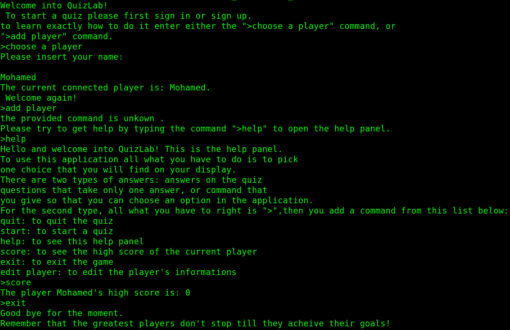
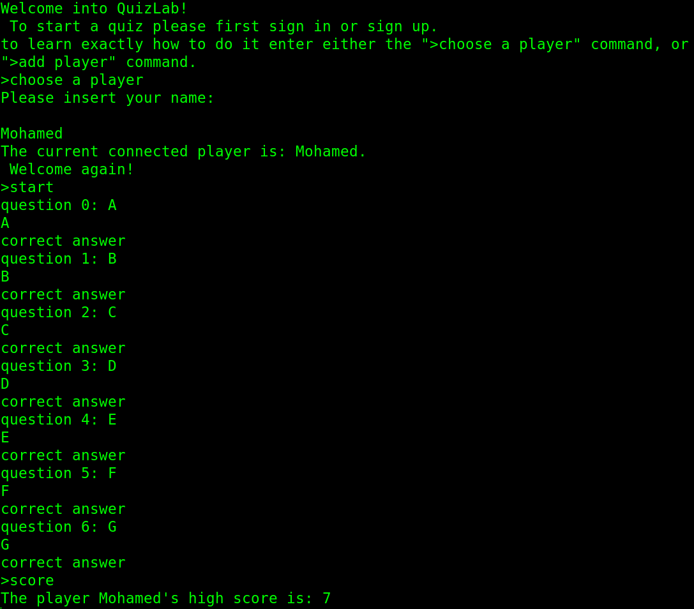

# QuizLab

> Welcome to QuizLab, a simple java console quiz application.

## Presentation

This application gives a simple quiz for the user and manage user's information and score.

Firstly, the user sign in or sign up. Then, the user can perform a set of actions using commands.

| Command | What it does |
| --- | --- |
| >choose a player | to sign in as an other user |
| >add player | to create new account |
| >edit player | to edit the current user information |
| >start | start the game |
| >quit | quit the game |
| >score | to see the current player's high score |
| >help | access the help panel |
| >exit | exit the application |

## Game preview
* Global setup:

* Game ON:

---

⚓ Please refer to the github repo [QuizLab](https://github.com/abdorah/QuizLabJavaFx) for the desktop version.
